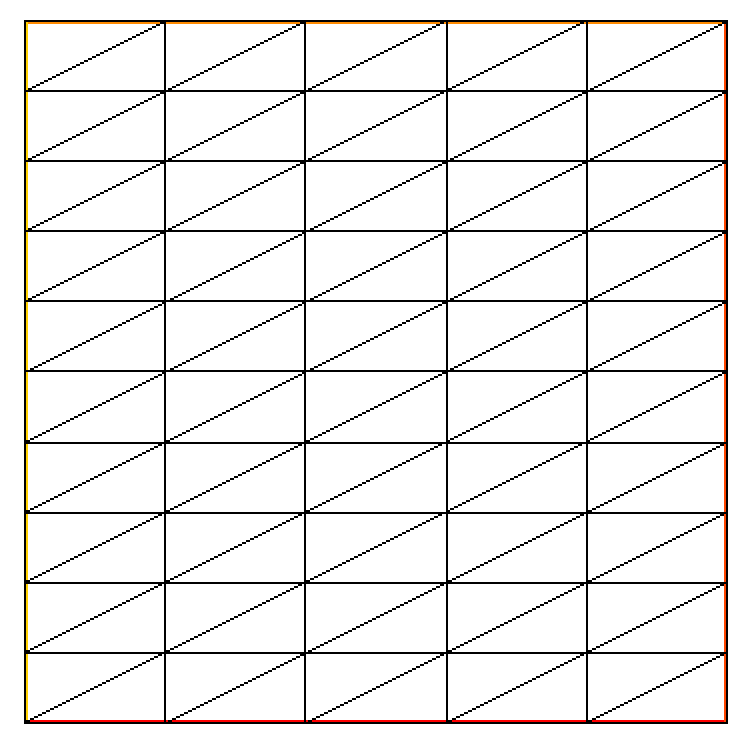
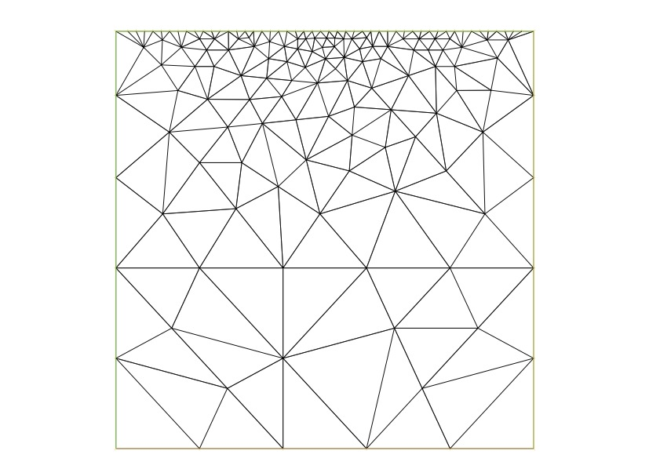
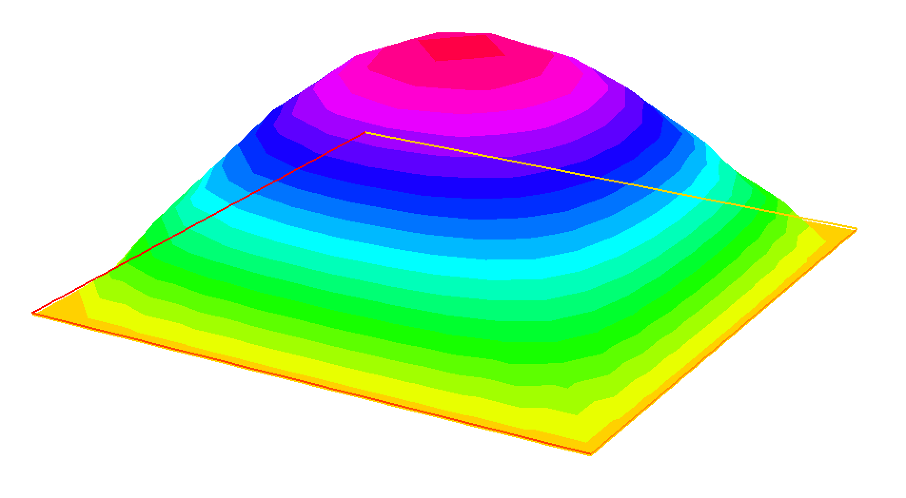

# FreeFEM による有限要素法の数値計算
Poisson方程式に対して，FreeFEMで有限要素解を計算するところまでを解説する．

## はじめに

### FreeFEM とは
- FreeFEM（[公式](https://freefem.org/)）は有限要素法の数値計算を行うためのプログラミング言語である．
- FreeFEMはその名の通り，open sourceのフリーソフトウェアである．
- 言語仕様はC++風．以前はFreeFem++という名前だった．
  
- FreeFEMでは偏微分方程式の弱形式を記述し，有限要素空間を設定するだけで有限要素解が得られるので大変便利．C++などの汎用言語で0から有限要素法のプログラムを書くのは，労力と時間がかかる．


### 他の有限要素ソフトウェア
- [FEniCSx](https://fenicsproject.org/)もFreeFEMと同様に有名なフリーな有限要素ソフトウェアである．
- FreeFEMよりも機能豊富であるが，その分コマンドが複雑でありFreeFEMよりも敷居が高い．

## FreeFEMの準備

### インストール
[GitHubのページ](http://github.com/FreeFem/FreeFem-sources/releases) 
からOSにあった最新バージョンのインストーラーをダウンロードして実行する．
例えば，Windowsの場合は `FreeFEM-4.12-win64.exe`が執筆時点では最新である．

### FreeFEM-cs に関する注意
- FreeFEM-cs (https://www.ljll.math.upmc.fr/lehyaric/ffcs/index.htm) 
というFreeFEM用のIDE(統合開発環境)もかつてはよく利用されていた．IDEはエディタやデバッガなどのプログラムの開発に必要なツール群がひとまとめになったGUIソフトウェアのことである．
- FreeFEM-csはもはやメンテナンスされていないようなので，FreeFEM-csの使用は非推奨である．少なくとも macOSでは動作しない．Windows 10 では一応動作するようだが，ファイルが保存できない事例があった．

### 実行確認

`コマンドプロンプト` あるいは `PowerShell` を（以下，ターミナルと呼ぶ）を起動する．
- `コマンドプロンプト`はWindowsメニューあるいは検索ボックスからかんたんに見つかる
- 「Windowsキー+R」→「ファイル名を指定して実行」→「cmdと入力してOK押下」で確実に起動できる．

適当なフォルダ（ここでは`fftest`）を作成し，移動する．
```@bash
mkdir fftest
cd fftest
```
適当なテキストエディタを起動する．ここでは「メモ帳」を起動する：
```
 Notepad hello.edp
``` 
以下の内容をコピペして（名前を変更せずに）保存する．
```@bash
cout << "Hello" << endl;
```
（`cout` は「ターミナルの画面」を表す変数というぐらいの認識で問題ない． `cout` に 
`<<` 演算子で文字列や数値，変数を流し込むとターミナルに表示される．
`endl` は改行を意味する．
末尾のセミコロンはプログラムの終端に必ずつける． 
このあたりは C++ の書き方と同じである．）

ターミナルに戻って，先程保存したソースファイルを実行しよう．
```@bash
FreeFem++ hello.edp 
```
入力コードなど色々表示されるがその中に `Hello` という文字列が確認できればOKである．

表示内容を抑制するには `-ne` オプションを付けて実行する．
```@bash
FreeFem++ -ne hello.edp 
```

## テキストエディタ
テキストエディタは無数に存在する．フリーかつクロスプラットフォームなものに限定すると，以下のソフトウェアがよく使われているようである．
- [Visual Studio Code](https://code.visualstudio.com/) (GUI)
- Vim, Emacs (ターミナル上で動くエディタ）

## 有限要素法の数値計算の概略
偏微分方程式の境界値問題に対して，
有限要素法の数値計算のおおまかな流れは次のとおり．
- メッシュの生成
- 有限要素空間の構成
- 有限要素解の計算（係数行列の構成→離散化方程式を解く）

次節から，各項目ごとにFreeFEMでの実装法を示していく．

## メッシュ生成

### 一様分割 [`square()`](https://doc.freefem.org/documentation/mesh-generation.html\#commands-for-2d-mesh-generation)

領域が単位正方形の場合は `square(nx, ny)`で
直角三角形による一様な分割が得られる．正確には，
$x$ 軸方向と $y$ 軸方向へそれぞれ `nx` 個,
`ny` 個に等分割して得られる格子をどちらか右斜（あるいは左斜め）に対角線を引いた三角形分割  (Friedrichs--Keller triangulation) が生成される．
```
// square.edp
int nx=5, ny=10;    // "int": integer type
mesh Th = square(nx, ny);  
plot(Th);  // display the mesh
```
上記のサンプルコードを実行し，下にあるような一様メッシュが表示されることを確認しよう．

 


## 境界のラベル
後述するように境界にはラベルが付けられる．
`square()`の場合は自動的に，下辺→右辺→上辺→左辺（反時計回り）の順に1,2,3,4 
という整数値のラベルが付く．

### bulidmesh()
一般の領域に対しては，(i) FreeFEMの`bulidmesh()`を用いる方法と，(ii) Gmshなどのソフトウェアで作成作成したメッシュを読み込む方法，の2種類がある．
はじめに，`buildmesh()`による方法について説明する．


### 領域の境界を定義: border 
はじめに`border` で
パラメータ曲線を与える．
例として，単位正方形の境界を反時計回りにパラメータ表示する

```
border b1(t=0,1) {x=  t; y=  0;label=1;} // 下辺
border b2(t=0,1) {x=  1; y=  t;label=2;} // 右辺
border b3(t=0,1) {x=1-t; y=  1;label=3;} // 上辺
border b4(t=0,1) {x=  0; y=1-t;label=4;} // 左辺
```

```
int n = 5; 
mesh Th = buildmesh(b1(n)+b2(n)+b3(10*n)+b4(n));
plot(Th,ps="mesh-buildmesh.eps"); // save the mesh in eps format
```
`buildmesh()`の引数は曲線の分割数を表している．
符号をマイナスにすると曲線の向きが反対になる．




\paragraph{注意} FreeFEMでは（大文字の） `N` は外向き単位法線ベクトルを表すので注意．
`int N=5;` などと書いてしまうとコンパイルエラーが発生しないで実行できてしまい，
予期しない動作になる．

### Gmshで作成したメッシュファイルの読み込み
[Gmsh](https://gmsh.info/)で作成した`msh`ファイルは `gmsh`パッケージをloadして`gmshload()`で読み込む．
```
load "gmsh"
mesh Th = gmshload(filename.msh);
```
#### 参考

- [Gmsh Tutorial](https://gmsh.info/doc/texinfo/gmsh.html#Tutorial)
- FreeFEM/[External libraries/Gmsh](https://doc.freefem.org/references/external-libraries.html#gmsh)

## 有限要素空間 
有限要素空間は `fespace` 型の変数として宣言する．
メッシュ `Th` に関する区分1次多項式（$P_1$要素） 
を有限要素空間として宣言するには次のようにする．
```
fespace Vh(Th, P1);   
```
第2引数の`P1` は $P_1$要素を表す．
FreeFEMでは有名な有限要素空間があらかじめ用意されている（[公式ドキュメント](https://doc.freefem.org/documentation/finite-element.html)）
`Vh(Th, P2)` とすれば $P_2$要素を指定できる．
3次以上の高次要素を指定する場合には適宜，専用のライブラリを
読み込む必要があるので注意．


## Poisson方程式の有限要素解の計算

### Poisson方程式
Poisson方程式のDirichlet境界値問題を考える．

```math
\begin{align}
 -\Delta u &= f \text{ in } \Omega, \\
 u &= g \text{ on } \partial\Omega.
\end{align}
```

ただし， $f$, $g$ は与えられた関数である．
ここでは簡単のために $g\equiv 0$とする．

$V_h \subset H_0^1(\Omega)$を有限次元の部分空間とする．
有限要素解は次で定義される：
Find $u_h \in V_h$ such that 
$$\int_\Omega \nabla u_h \cdot \nabla v_h dx = \int_\Omega fv_h dx   \quad \forall v_h \in V_h.  $$

ここでは例として，次をテスト問題として考える．

 - $\Omega = (0,1)^2$: 単位正方形領域
 - $f(x,y) = 2\pi^2\sin(\pi x)\sin(\pi y)$

このとき，厳密解は
$$u(x,y) = \sin(\pi x)\sin(\pi y) $$
となる．

#### FreeFEMコードの例
はじめにテスト問題の有限要素解を計算するコードを示しておく．
これを実行して有限要素解がきちんと表示されることを各自で確かめておくこと．
```
// poisson.edp
int n = 10;
mesh Th = square(n, n);
func f = 2*pi^2*sin(pi*x)*sin(pi*y);
fespace Vh(Th, P1);
Vh u,v;
solve poisson(u,v) = 
 int2d(Th)(dx(u)*dx(v)+dy(u)*dy(v)) - int2d(Th)(f*v)
 + on(1, 2, 3, 4, u=0);
plot(u, fill=true, dim=3);
```




### 弱形式の記述
```
solve poisson(u,v) = (u,v を含む) 式
```
は （任意の）試験関数 `v` に対して "式=0" が成り立つような `u` を（方程式を解いて）求める命令である．
`poisson`は問題の名前を表し，適当にわかりやすい名前に設定する．

弱形式の左辺
$$\int_\Omega \nabla u_h \cdot \nabla v_h dx = \int_\Omega \left(\partial_x u_h \partial_x v_h + \partial_y u_h \partial_y v_h \right) dx  $$
は FreeFEMでは
```
int2d(Th)(dx(u)*dx(v) + dy(u)*dy(v))
```
と記述する．


右辺に現れる$f(x,y)$は次のように関数として定義しておく．
```
func f = 2*pi^2*sin(pi*x)*sin(pi*y);
```
FreeFEMでは`x`, `y` はそれぞれ $x$, $y$座標に関する独立変数として定義されている．弱形式の右辺
$(\int_\Omega fv_h dx)$
は
```
 int2d(Th)(f*v)
```
と記述する．

Dirichlet境界条件は `on(境界のラベル, 境界条件)` と記述する．
```
  on(1,2,3,4, u=0)     
```

### 線形ソルバー

`solve()` 用いられる線形ソルバー（連立一次方程式を解くためのライブラリ）はデフォルトでは UMFPACKという疎行列向け直接法である．疎行列は大部分の成分がゼロであるような行列のことである．
有限要素法では，係数行列は一般に疎行列となるので，疎行列向けの線形ソルバーを用いるのが普通である．2次元Poisson方程式の場合はUMFPACKで問題なく解けるので，ここではデフォルトのままでよい．

FreeFEMではGMRES法という疎行列向け反復法も用意されている．GMRES法を線形ソルバーとして指定するにはオプション引数を次のように与える．
```
solve poisson(u, v, solver=GMRES) = ...
```

#### 線形ソルバーの種類
線形ソルバーは大きく分けて，直接法と反復法の2種類がある．
直接法は大抵の問題は解けるが，メモリ使用量が多い．
反復法はメモリ使用量は直接法に比べて大幅に減らせるが，解ける問題の範囲は狭くなる．


疎行列向けの反復法として，対称行列に対してはCG法とMINRES法が，
非対称行列に対してはBiCGSTAB法やGMRES法などが有名である．
経験則として，大抵の場合はMINRES法やGMRES法で問題なく解ける．[^1]

[^1]: GMRES法とMINRES法は「残差が単調減少（非増加）である」ことが数学的に保証されている．CG法やBiCGSTAB法は時には残差が爆発的に増加して計算が破綻する恐れがあるのに対して，GMRES法・MINRES法は計算が破綻する可能性は（理論的には）ない．


#### UMFPACKの32bit制限
UMFPACKでは
メモリ使用量が2GBを超えた場合，搭載メモリに余裕があっても out of memory エラーが発生することがある．
これは32bit 整数型でコンパイルされたことが原因らしい（2GBは 32bit整数型の限界値: $2^{32}$ バイト =約2GB)．
そのような場合は64bit版UMFPACKを使用すればよい．FreeFEMで
コードの冒頭に次の１文を追記すればよい．
```
load "UMFPACK64"  
```

### 解の表示
`plot`コマンドで関数やメッシュが表示できる．
求めた有限要素解を表示するには，例えば次のように書く：
```
plot(u, fill=true, dim=3);
```

#### オプション
 
 - `fill=true`: 関数のグラフを塗りつぶす
 - `dim=3`: 関数の3次元グラフとして描画する
 - `wait=true`: 描画ウィンドウを表示した状態で待機状態にする．ユーザーがキー入力するまでプログラムの進行も停止する

ウィンドウが表示されてからも `v` キーでカラーバーを表示したり，
`m`キーでメッシュの重ね書きなどもできる．
 `?` キーを押すと機能一覧が表示される．

## 誤差の計算 
厳密解を$u$, 有限要素解を$u_h$とする．
### $H^1$ 誤差の計算
$H^1$誤差 
```math
|u - u_h|_{H^1(\Omega)} = \left( \int_\Omega [(\partial_x (u-u_h))^2+(\partial_y (u-u_h))^2] dx \right)^{1/2}
```

を計算するコード例：
```
func dxuex = pi*cos(pi*x)*sin(pi*y);        
func dyuex = pi*sin(pi*x)*cos(pi*y);        
real h1err;  // 倍精度 (double) 浮動小数点型
h1err = sqrt(int2d(Th)((dxuex-dx(u))^2+(dyuex-dy(u))^2));
cout << "H1-error: " << h1err << endl;
```


### $L^2$ 誤差の計算
$L^2$誤差 
```math
\|u - u_h\|_{L^2(\Omega)} = \left( \int_\Omega (u-u_h)^2 dx \right)^{1/2} ```

の計算コード例：
```python
func uex = sin(pi*x)*sin(pi*y);        //厳密解
real l2err;
l2err = sqrt(int2d(Th)((uex-u)^2));
cout << "L2-error: " << l2err << endl;
```


### メッシュサイズの取得
各要素のサイズは `hTriangle` で取得できる．
これの最大値が メッシュサイズ になる．
```
// meshsize.edp
mesh Th = square(10,10);
fespace Ph0(Th,P0);  // 区分定数
Ph0 hh = hTriangle;  // 各三角形上でその直径を値とする区分定数関数
real hmax = hh[].max; // 最大値がメッシュサイズ
cout << hmax << endl;
```

上記コードでは $10\times 10$ の一様メッシュのメッシュサイズを出力される．
メッシュサイズの理論値は $\sqrt{2}/10$のなので，
 `0.141421` が出力されていれば正常である．
```
$ FreeFem++ -ne meshsize.edp
[...]
0.141421
[...]
```


### 収束次数の計算

2つメッシュ $\mathcal{T}_h$,  $\mathcal{T}_{h'}$ 
に対する有限要素解 $u_h, u_{h'}$ を計算する．
誤差を$e_h = u - u_h$, $e_{h'} = u - u_{h'}$ とおく．

ここでは $\mathcal{T}_h$, $\mathcal{T}_{h'}$ は
それぞれ $40\times 40$ 分割， $80\times 80$ 分割の一様な三角形分割とする．
メッシュサイズは $h=\sqrt{2}/40$, $h' = h/2 = \sqrt{2}/80$である．
これらのメッシュサイズと誤差から，
$$\frac{\log\|e_h\|- \log \|e_{h'}\|}{\log h - \log  h'} =   \frac{\log(\|e_h\|/\|e_{h'}\|)}{\log(h/h')} $$
を計算し，これを収束次数（の推定値）とする．ここで$\|\cdot\|$は適当なノルムとする．


# Appendix
## FreeFEMの変数型
[公式ドキュメント](https://doc.freefem.org/references/types.html)を参照．

- `int`: 整数型
- `real` :倍精度
- `complex}: 複素数型．$x+yi$ は \code{x + y*1i`と表す．ただし，$x,y$は実数，$i$は虚数単位．